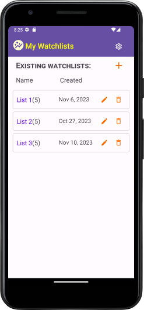
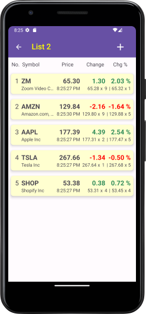
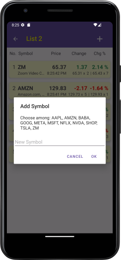
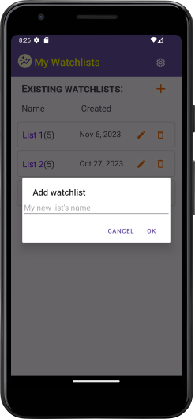
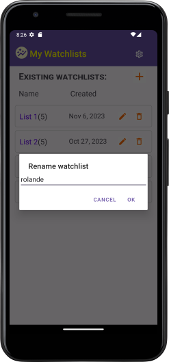
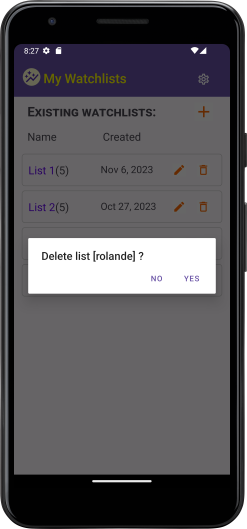
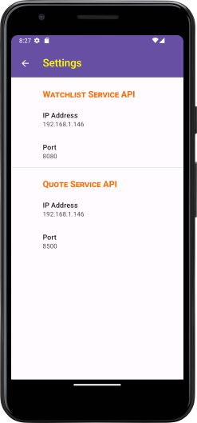

# My Watchlists - Android Client
Simple Android client mobile app making use of the _Watchlist_ and _Quote_ REST APIs services.  

### Infos:
- Project built using Android Studio, written in Java
- Services location: Configurable in app' settings
- See recording demo & screenshots [below](#demo--screenshots)

### Description:
This project consist of 3 activities: Main (Watchlist), Watchlist Detail and Settings.

Upon start, the `main` activity fetches the list of existing watchlists from the _Watchlist_ service.
User may then perform CRUD operations on them, i.e. get, add, modify and delete a watchlist.

Getting a watchlist starts the `watchlist_detail` activity, which obtains the watchlist's list
of securities and displays the latest quote for them.  Quotes will then be refreshed, using the
_Quote_ service, within 1 to 10 seconds later to simulate real-time markets. User may also add or
delete symbols (securities) from the watchlist while quotes are being updated. 

Finally, user may configure the location of the services using the app's `settings` activity.

This app makes use of all endpoints defined by the two services' API.
   
### Demo & Screenshots
- Watch: [Live Demo](https://github.com/RolandeSTG/my-watchlists-android/assets/112976983/273bf123-745b-4ad3-ae04-cf05c0be6314)

- Sample Screenshots: 
<!--
  1. [Get watchlists](assets/1_get_watchlists.png)
  1. [Get watchlist\' securities](assets/2_get_watchlist_securities.png)
  1. [Add symbol](assets/3_add_symbol.png)
  1. [Add watchlist](assets/4_add_watchlist.png)
  1. [Rename watchlist](assets/5_rename_watchlist.png)
  1. [Delete watchlist](assets/6_delete_watchlist.png)
  1. [Configure service locations](assets/7_settings.png.png)
  -->

<!-- The way below allows to provide thumbnail images which
     can be clicked to see the actual (much bigger) one -->
|                                                      Get Watchlists                                                      |                                                                Get Securities                                                                |                                                  Add Symbol                                                  |                                                     Add Watchlist                                                     |                                                        Rename Watchlist                                                        |                                                        Delete Watchlist                                                        |                                                Settings                                                |
|:------------------------------------------------------------------------------------------------------------------------:|:--------------------------------------------------------------------------------------------------------------------------------------------:|:------------------------------------------------------------------------------------------------------------:|:---------------------------------------------------------------------------------------------------------------------:|:------------------------------------------------------------------------------------------------------------------------------:|:------------------------------------------------------------------------------------------------------------------------------:|:------------------------------------------------------------------------------------------------------:|
|  |  |  |  |  |  |  |
